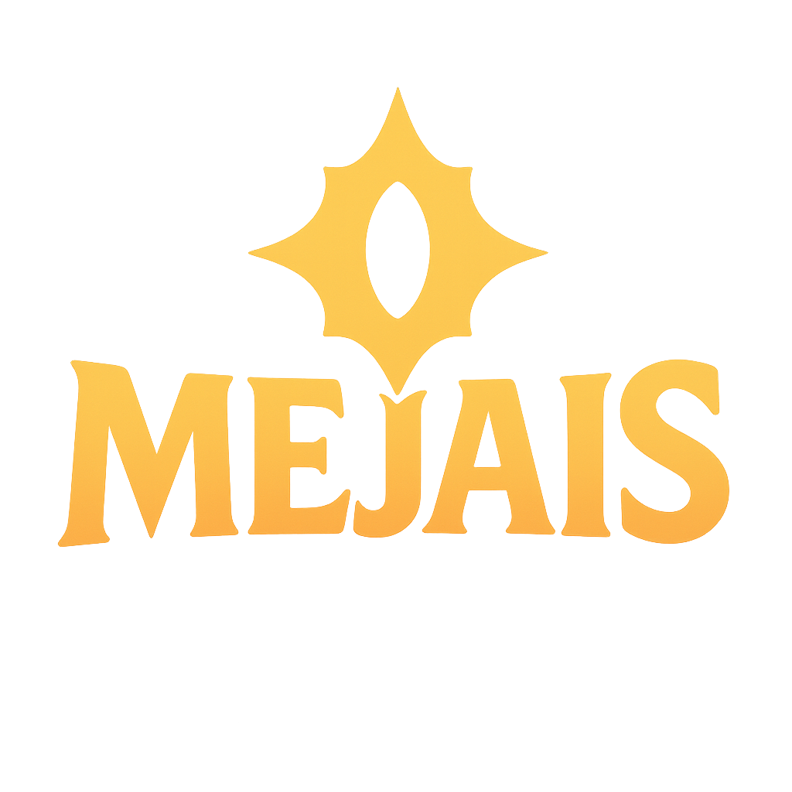

# Mejais

Mejais is your personal League of Legends draft assistant, designed to give you a competitive edge before the game even starts. By analyzing millions of high-tier matches, Mejais provides real-time insights and recommendations during Champion Select.

## How to Use Mejais

### 1. Live Game Analysis
While in an active Champion Select in the League of Legends client, Mejais will automatically mirror the picks and bans in the 'Game' view. It analyzes team compositions and suggests the strongest champions for you to play based on synergies, counters, and overall team strength.

### 2. Simulate a Draft
Want to theorycraft or prepare for a specific matchup? You can manually simulate a draft. Simply click on any empty champion slot to open the champion grid and make a selection. To clear a pick, just right-click on the champion's icon.

### 3. Explore Champions
Navigate to the 'Champions' tab to see detailed statistics for every champion. Select a champion to view their best and worst matchups, helping you understand their strengths and weaknesses in lane.

### 4. Role Assignment
Roles are typically assigned automatically based on the most common positions for each champion. If you're planning an off-meta pick, you can manually change the assigned role to refine the recommendations for your team's unique strategy.

Ready to climb? Let Mejais guide your draft!

## Updating the Stats Snapshot (maintainer-only)

The `snapshot-kit/` project is only for maintainers. Run it locally (or on your server) with your production Riot API key to regenerate `data/snapshot.db`, then bundle that SQLite file with each release or host it for download. Regular users never touch `snapshot-kit` or supply API keys—public Mejais builds are always fully offline.

## Legal
Mejais isn't endorsed by Riot Games and doesn't reflect the views or opinions of Riot Games or anyone officially involved in producing or managing Riot Games properties. Riot Games, and all associated properties are trademarks or registered trademarks of Riot Games, Inc.
